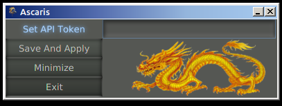
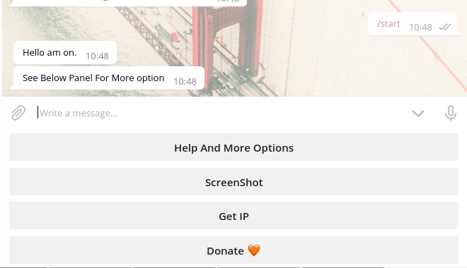
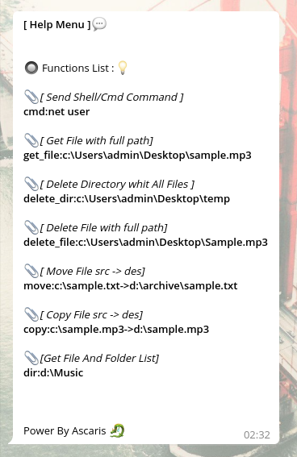

# Ascaris
The software runs Java and runs on a variety of operating systems, such as Windows, Linux, Mac, and so on. The goal of the software is the management and control of home and server systems Through telegram robot.
In this way, by entering your robot token in the input field of the software, you can run the commands described in the description :

- Send Shell/Cmd Command
- Get ScreenShot
- IP Adress [Public / Private]
- Get And Download Server File
- Delete File And Folder
- Move , Copy 
- Get List Of File And Folder
- And More ...

**Screenshot of The Main Window** 
  

**Keyboard Markup Section** 
  

**Help Menu** 
  
